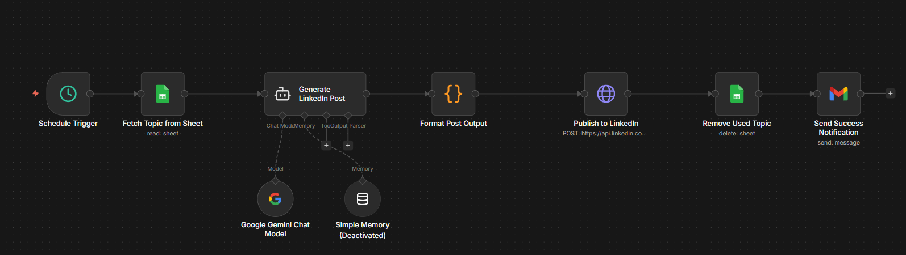

# 🤖 Autonomous LinkedIn Content Engine — n8n Agentic Workflow

> Architected an end-to-end agentic workflow that autonomously generated, validated, and published LinkedIn posts for **80+ consecutive days** — zero manual intervention.

---

## 📌 Overview

This project automates the entire LinkedIn content lifecycle using **n8n** as the orchestration layer. An LLM generates the post, a validation agent checks quality, and the content is published directly via the LinkedIn API — all on a scheduled cadence, fully unattended.

**Result:** 80+ consecutive days of consistent LinkedIn presence with no human involvement.

---

## 🏗️ Architecture

```
┌─────────────────────────────────────────────────────────┐
│                     SCHEDULER (Cron)                    │
│              Triggers daily at defined time             │
└───────────────────────┬─────────────────────────────────┘
                        │
                        ▼
┌─────────────────────────────────────────────────────────┐
│               CONTENT GENERATION (LLM)                  │
│       Prompt → Google Gemini → Draft post content       │
└───────────────────────┬─────────────────────────────────┘
                        │
                        ▼
┌─────────────────────────────────────────────────────────┐
│                 CLEAN OUTPUT                            │
│   Strips formatting artifacts → publish-ready text      │
└───────────────────────┬─────────────────────────────────┘
                        │
                        ▼
┌─────────────────────────────────────────────────────────┐
│              AUTO-PUBLISH (LinkedIn API)                 │
│           Posts directly to LinkedIn profile            │
└───────────────────────┬─────────────────────────────────┘
                        │
                        ▼
┌─────────────────────────────────────────────────────────┐
│           LOGGING & NOTIFICATION                        │
│     Google Sheets (log) + Gmail (status notification)   │
└─────────────────────────────────────────────────────────┘
```

---

## 🖼️ Workflow Canvas



---

## ⚙️ Tech Stack

| Layer | Tool |
|---|---|
| Workflow Orchestration | n8n |
| Content Generation | Google Gemini (via n8n AI Agent node) |
| Validation | Output parser + CleanOutput function node |
| Publishing | LinkedIn API (HTTP Request) |
| Logging | Google Sheets |
| Notifications | Gmail |
| Scheduling | n8n Cron Node |

---

## 🔄 Workflow Breakdown

### 1. Scheduler
- Cron-based trigger fires at a set time daily
- Kicks off the full pipeline with zero manual input

### 2. Google Sheets (Topic Source)
- Reads the next topic/prompt from a Google Sheet
- Acts as a content queue — each row is a scheduled post idea

### 3. Content Generation (Google Gemini)
- n8n AI Agent node powered by Google Gemini Chat Model
- Generates a LinkedIn post based on the topic pulled from Sheets
- Output Parser ensures the response is clean and structured

### 4. CleanOutput
- Function node that strips any unwanted formatting or artifacts
- Ensures the final post text is publish-ready

### 5. Auto-Publish (LinkedIn API)
- HTTP Request node POSTs directly to `api.linkedin.com`
- No copy-paste, no human approval step

### 6. Logging & Cleanup
- Used row is deleted from Google Sheets after publishing
- Keeps the content queue clean and prevents re-publishing

### 7. Gmail Notification
- Sends an email confirmation on every successful post
- Instant visibility into failures without manual monitoring

---

## 📁 Repository Structure

```
n8n-linkedin-automation/
├── README.md
├── flows/
│   └── linkedin-automation.json          # Full workflow export
└── screenshots/
    └── workflow-overview.png             # n8n canvas screenshot
```

---

## 🚀 How to Import & Run

1. Start n8n using Docker:
   ```bash
   docker run -it --rm --name n8n -p 5678:5678 -v n8n_data:/home/node/.n8n docker.n8n.io/n8nio/n8n
   ```

2. Open `http://localhost:5678` in your browser

3. Go to **Workflows → Import from file**

4. Import `linkedin-automation.json` from the `/flows` folder

5. Add your credentials in n8n:
   - Google Gemini API key
   - LinkedIn OAuth token
   - Google Sheets OAuth (Google account)
   - Gmail OAuth (Google account)

6. Activate the workflows — the scheduler takes it from there

---

## 💡 Key Design Decisions

- **Google Sheets as content queue** — topics are stored as rows in a Sheet; the flow reads the next one, uses it, then deletes it — clean and self-managing
- **CleanOutput function node** — acts as a post-processing layer to strip LLM artifacts before publishing, ensuring every post looks hand-written
- **Gmail failure alerts** — immediate email notification on success or failure so issues are caught without any manual monitoring

---

## 📊 Outcome

| Metric | Result |
|---|---|
| Consecutive days automated | 80+ |
| Manual interventions required | 0 |
| Human approval steps | None |
| Consistency | 100% (no missed days) |

---

## 🛠️ Built With

- [n8n](https://n8n.io) — open-source workflow automation
- [Google Gemini API](https://ai.google.dev) — LLM for content generation
- [LinkedIn API](https://developer.linkedin.com) — auto-publishing
- [Google Sheets API](https://developers.google.com/sheets) — content queue & logging
- [Gmail API](https://developers.google.com/gmail) — run notifications

---

*Part of my automation portfolio. Built to solve a real consistency problem — and it worked.*
